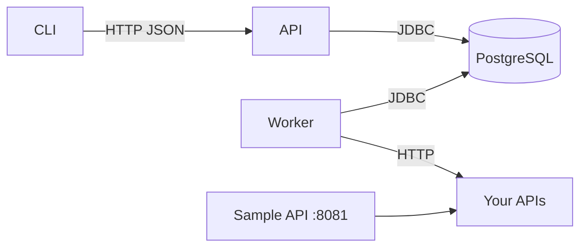

# Backline

Backline is a local-first API regression ledger for backend developers.

## What Backline is

Backline stores **HTTP check definitions** and **run results** in PostgreSQL, executes checks asynchronously through a **worker**, and exposes **history, diff, and Markdown reports** through a REST API and a **Picocli-based CLI**. It is meant for repeatable API regression tracking on your machine or in a demo environment.

## What it is not

**Backline is not a Postman replacement.** Postman is an interactive request-builder and collaboration surface for ad-hoc calls. Backline is a **queryable regression ledger**: checks are versioned config, runs are durable records, and comparisons are first-class. Use Postman (or similar) to explore; use Backline to record whether behavior regressed.

Backline is also **not** a load-testing tool, hosted SaaS monitor, multi-tenant platform, or general CI orchestrator. See [docs/known-limitations.md](docs/known-limitations.md).

## Architecture (summary)

- **CLI** (`apps/cli`): reads `backline.yml`, talks to the API over HTTP, waits on run status, renders history/diff, writes Markdown reports.
- **API** (`apps/api`): validation, persistence, Flyway migrations, OpenAPI, Actuator health, run/diff/history endpoints.
- **Worker** (`apps/worker`): claims `QUEUED` runs, executes HTTP checks (via `libs/executor`), writes results and terminal run status.
- **PostgreSQL**: sole durable store (see `db/migration`).
- **Sample API** (`apps/sample-api`): trivial Spring Boot app on **8081** with predictable passing, failing, slow, and schema-shift endpoints for demos.
- **Report generator** (`libs/reporting`): builds Markdown from API DTOs already fetched by the CLI (no direct DB access).



## Prerequisites

- **Java 21** (Gradle toolchain enforces this).
- **Docker** (recommended) for `docker compose`, or a local PostgreSQL reachable with the JDBC URL in `.env`.
- Optional: **curl** for manual health checks (included in API container image used by Compose health checks).

## Quick start (demo path)

From the repository root:

```bash
cp .env.example .env
docker compose up --build -d
./gradlew :apps:cli:installDist
export PATH="$PWD/apps/cli/build/install/backline/bin:$PATH"
backline doctor
backline sample init
backline sample serve
```

In another terminal (same `PATH` if needed):

```bash
cd examples/sample-api
backline run
backline history
backline diff <runId>
backline report <runId>
```

To emit a machine-readable artifact for CI or post-processing:

```bash
backline report <runId> --json-output ./build/backline-report.json
```

You can choose the diff baseline strategy:

```bash
backline diff <runId> --baseline LAST_PASSED
backline diff <runId> --baseline FIXED_RUN --fixed-run-id <baselineRunId>
```

For policy-enforced runs, the same baseline options apply:

```bash
backline run --enforce-policy --baseline LAST_PASSED
```

### Optional CI policy enforcement

Backline can evaluate run outcomes against policy thresholds in `backline.yml`:

```yaml
policy:
  max_newly_failing: 0
  max_errored_checks: 0
  max_latency_regression_ms: 200
```

Then run:

```bash
backline run --enforce-policy --junit-output ./build/backline-policy.xml
```

When policy checks fail, the command exits with code `5` and prints violations. The optional JUnit file lets CI systems annotate the failure.

**PowerShell** examples:

```powershell
Copy-Item .env.example .env
docker compose up --build -d
.\gradlew.bat :apps:cli:installDist
$env:Path = "$PWD\apps\cli\build\install\backline\bin;$env:Path"
backline doctor
backline sample init
backline sample serve
```

```powershell
Set-Location examples\sample-api
backline run
backline history
backline diff <runId>
backline report <runId>
```

**Sample API in Docker (optional profile):** instead of `backline sample serve`, you can run:

```bash
docker compose --profile demo up -d sample-api
```

so the stack on **8080/5432/8081** comes entirely from Compose.

**CLI distribution:** `:apps:cli:installDist` is the expected way to get a `backline` script on your `PATH`; it requires the Gradle **Application** plugin on `apps:cli` (Task 4). If Gradle reports that the task is unknown, use `./gradlew :apps:cli:build` until the integration pass adds the launcher.

## Running tests

```bash
./gradlew test
```

Focused:

```bash
./gradlew :apps:sample-api:test
./gradlew :libs:reporting:test
./gradlew :apps:api:test
./gradlew :apps:worker:test
./gradlew :apps:cli:test
```

Windows: prefix with `.\gradlew.bat`.

## Performance testing

Backline includes a local perf harness under [perf/README.md](perf/README.md).

```powershell
.\perf\run-local.ps1 -Profile smoke
.\perf\run-local.ps1 -Profile small
.\perf\run-local.ps1 -Profile multi-worker
```

Detailed setup, outputs, limitations, and pass/fail criteria live in `perf/README.md`.

## Module layout

```txt
apps/
  api/          Spring Boot REST API + persistence (Flyway)
  worker/       Spring Boot worker loop
  cli/          Picocli CLI distribution
  sample-api/   Demo-only HTTP service (:8081)
libs/
  core/         Shared DTOs, enums, API wrappers
  config/       backline.yml parsing + validation
  executor/     HTTP execution + assertions (worker)
  reporting/    Markdown report generation
db/migration/   Flyway SQL
examples/sample-api/
  backline.yml  Canonical demo checks
docs/           API examples, limitations, demo script
```

## API documentation

- **Swagger UI:** `http://localhost:8080/swagger-ui.html` (may redirect to `swagger-ui/index.html`).
- **OpenAPI JSON:** `http://localhost:8080/v3/api-docs`

Copy/paste **curl** samples: [docs/api-examples.md](docs/api-examples.md).

CI integration and policy gating details: [docs/ci-integration.md](docs/ci-integration.md).
Quality and runtime hardening checklist: [docs/audit-playbook.md](docs/audit-playbook.md).
Cross-module contracts: [docs/contracts.md](docs/contracts.md).
Operations runbook: [docs/runbook.md](docs/runbook.md).

## Quality snapshot

Coverage floors are enforced by `./gradlew check` (JaCoCo). Module line floors match the Q10 table in `PLAN.md`; API and worker also enforce branch floors (0.40 / 0.35). CI publishes a per-module coverage summary (including API branch) on every PR.

Final sign-off uses the weighted rubric in [docs/audit-playbook.md §8](docs/audit-playbook.md) (Correctness, Coverage depth, Full-stack proof, Test rigor, Security / guardrails, Operability, Sustain / drift). Q14 records dated scores when every dimension is >= 9.0.

## Public site

The standalone landing page lives in [`site/`](site/README.md). It is a Vite/TypeScript static site with its own lockfile and CI; it is not a Gradle module, does not render a dashboard, and does not require the API, worker, or PostgreSQL to build.

```bash
cd site
npm ci
npm run typecheck
npm run lint
npm test
npm run build
npm run browser:test
```

Quick audit command:

```bash
./scripts/audit-strength.sh
```

## Demo path (detailed)

Step-by-step reviewer script: [docs/demo-script.md](docs/demo-script.md).

## Known limitations

Product and scope limits: [docs/known-limitations.md](docs/known-limitations.md).

## Troubleshooting

| Issue | What to try |
| --- | --- |
| Docker not running | Start **Docker Desktop** (Windows/macOS) or the Docker engine service (Linux), then re-run `docker compose up`. |
| Port **8080** or **8081** in use | Change host mapping in `docker-compose.yml`, or stop the conflicting process. For the sample API locally, set `BACKLINE_SAMPLE_PORT` in `.env` and align `backline.yml` URLs. |
| Database / Flyway errors on first start | If data is disposable: `docker compose down -v` to remove the `pgdata` volume, then `docker compose up --build` again. |
| Worker not picking up runs | Confirm the **worker** container is running and logs show DB connectivity; ensure runs reach `QUEUED` via `POST /api/runs` / `backline run`. |
| `./gradlew test` fails with `IllegalStateException: Could not find a valid Docker environment` | API and worker integration tests use **Testcontainers** and require a running Docker engine. Start **Docker Desktop** (Windows/macOS) or the Docker daemon (Linux). On Windows, ensure WSL 2 integration is enabled in Docker Desktop settings. If Docker is unavailable, Testcontainers tests are skipped automatically; non-Docker tests still run. |

## Docker images

Multi-stage **Dockerfiles** live under `apps/api/Dockerfile`, `apps/worker/Dockerfile`, and `apps/sample-api/Dockerfile`. Compose file: `docker-compose.yml` (project name **`backline`**). Validate with `docker compose config`.

## License

MIT
